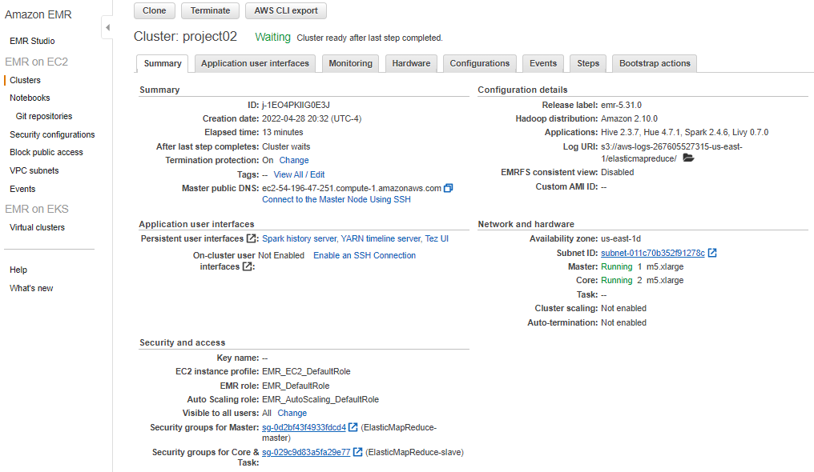
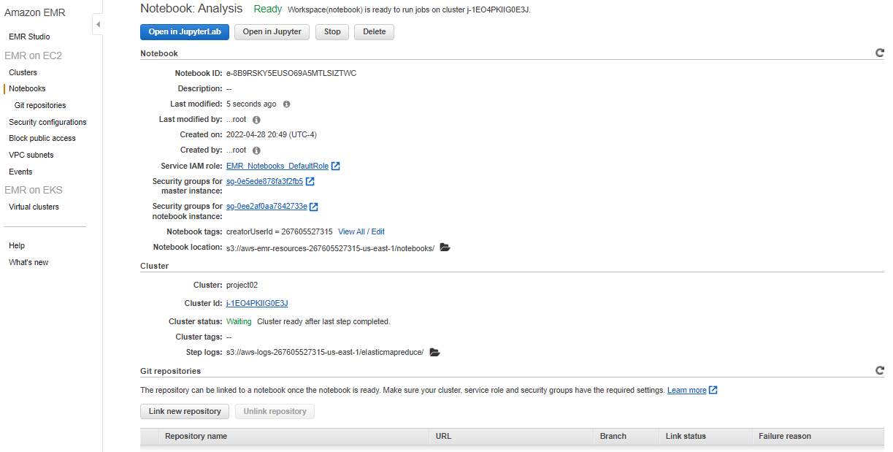

# Project 2: Analyzing 10GB of Yelp Reviews Data

## Introduction
In this project for Big Data Technologies class I analyzed ~10GB of Yelp review data using [Amazon Web Service's EMR platform](https://aws.amazon.com/emr/) to run Apache spark and help answer some exploratory questions on review skewness. The datasets used for this project were uploaded and stores in Amazon S3 and can originally be found [on Kaggle here](https://www.kaggle.com/datasets/yelp-dataset/yelp-dataset).

## Configuration
The configuration for the AWS EMR cluster can be seen in the screenshot below:

The configuration for the EMR notebook can be seen in the screenshot below:

## Zip Structure
You can find this project on [my public github repo here](https://github.com/xyjiang970/bigdatatechClass/tree/main/project02) that follows the structure shown below:

project02
+-- Analysis.ipynb
+-- Analysis.pdf
+-- assets
+-- +-- cluster_configuration.png
+-- +-- notebook_configuration.png
+-- README.md
 
