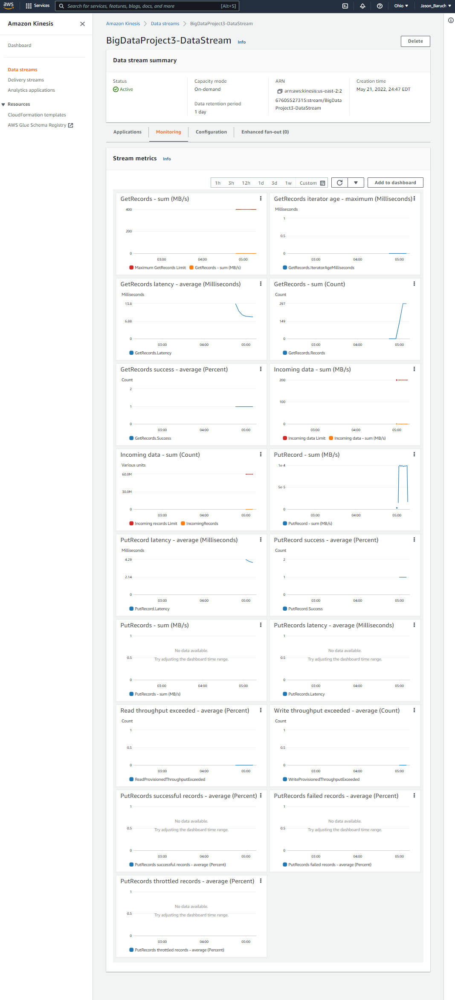
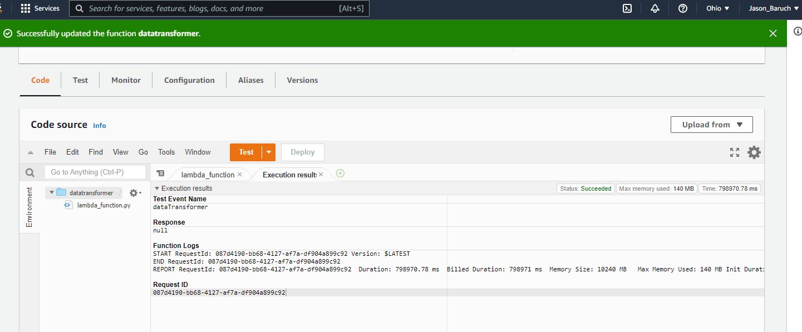
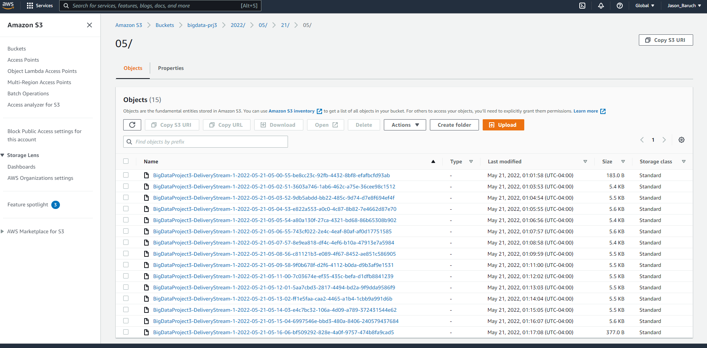

# Streaming Finance Data with AWS Lambda

## Introduction
This project consists of four major infrastructure elements that work in tandem:
1. A lambda function that fathers our data (**DataTransformer**).
2. A Kinesis stream that holds our data (**DataCollector**).
3. A serverless process that allows us to query our S3 data (**DataAnalyzer**).
4. Visualizations of the query results (**DataVisualization**).

### Process Breakdown
- I first set up a Kinesis Delivery Stream.
- Then, I wrote a lambda function (data_transformation.py) using the help of the [yfinance library](https://pypi.org/project/yfinance/).
**Note:**
Environment variables are needed (REGION and STREAMNAME) as they are not hardcoded into the data_transformer.py file!

- Next, I configured AWS Glue and directed it towards the S3 Bucket I created to hold this project's stream files.
- Afterwards, I used AWS Athena to analyze and query the gathered data.
- Finally, I used Jupyter Notebooks to generate two visualizations.

### Project 3 Folder Structure:
project03

+-- results.csv

+-- results.png

+-- query.sql

+-- data_transformer.py

+-- Analysis.ipynb 	

+-- Analysis.pdf 	

+-- finance_data.zip

+-- assets

+-- +-- kinesis_config.png

+-- +-- screenshot_of_s3_bucket.png

+-- +-- exec_results.png

+-- README.md

## AWS Kinesis Configuration

## AWS Lambda Execution Results

## AWS S3 Bucket

